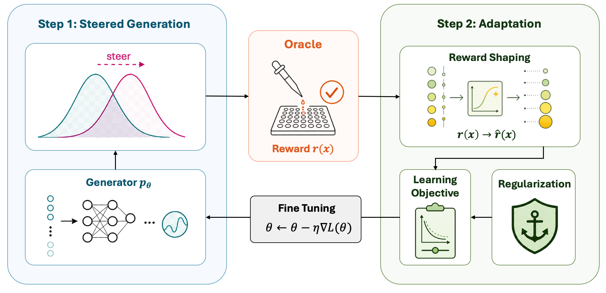

# Genesis Discovery Harness

Code for the paper **"Evaluating the Design Space of Test-Time Scaling for Molecular Optimization with Discrete Diffusion"** (NeurIPS 2026 submission).

We benchmark inference-time search and test-time fine-tuning strategies built on top of [GenMol](https://github.com/arielyyd/genmol), a masked discrete-diffusion model over SAFE molecular representations. The oracle throughout is [FlashAffinity](https://github.com/BIMSBbioinfo/FlashAffinity) (FA), a fast binary-head binding classifier, evaluated across six protein pockets.



The headline finding is that online fine-tuning (DDPP-LB + CVaR reward shaping + Thompson exploration via ensemble surrogate + replay buffer + invalid-SMILES penalty) dominates all pure inference-time search strategies under a fixed GPU-hour budget.

---

## Installation

Requires Python 3.10 and a CUDA-capable GPU (experiments run on A100 80 GB).

```bash
conda create -n genmol python=3.10
conda activate genmol
pip install -r env/requirements.txt
pip install -e .
pip install scikit-learn==1.2.2   # required for PMO hit-generation tasks
```

### Pretrained assets (download once)

| Asset | Source |
|-------|--------|
| `model_v2.ckpt` (1.4 GB) | [GenMol release](https://github.com/arielyyd/genmol) — second-vocab-fix release |
| FlashAffinity checkpoint `binary_1.ckpt` | Place under `FlashAffinity/checkpoints/` |
| Per-pocket ESM3 protein features | Precomputed; cache at `FlashAffinity/data/protein_test/repr/esm3.lmdb` |

---

## Running key experiments

All scripts are under `scripts/`. Set `CUDA_VISIBLE_DEVICES` before running.

### Full 5-method comparison (17 hr)

Runs unconditional baseline, offline DDPP, MCTS search, DDPP+CVaR, and MCTS+CVaR sequentially on a single GPU:

```bash
CUDA_VISIBLE_DEVICES=0 python scripts/run_v2.py \
    --config configs/comparison/v2_all_methods.yaml
```

Smoke-test every method in ~10 minutes before committing:

```bash
CUDA_VISIBLE_DEVICES=0 python scripts/run_v2.py \
    --config configs/comparison/v2_all_methods.yaml --test
```

Run specific phases only (0=uncond, 1=ddpp, 2=mcts, 3=ddpp+cvar, 4=mcts+cvar):

```bash
CUDA_VISIBLE_DEVICES=0 python scripts/run_v2.py \
    --config configs/comparison/v2_all_methods.yaml --phases 0,1,3
```

### DDPP-LB fine-tuning (4 hr)

Offline data collection followed by DDPP-LB training and CVaR sharpening:

```bash
python scripts/run_ddpp_lb.py \
    --model_path model_v2.ckpt \
    --wall_budget_sec 14400 \
    --output_dir outputs/ddpp_lb_4hr \
    --gpu 0
```

### Online active-learning loop

Interleaves generation, surrogate screening, oracle calls, and fine-tuning updates:

```bash
python scripts/run_active_loop.py \
    --model_path model_v2.ckpt \
    --n_epochs 20 \
    --M 500 \
    --K 25 \
    --tau_mode cvar \
    --output_dir outputs/active_loop_cvar
```

### Inference-time search baselines

```bash
# MCTS with FlashAffinity oracle
python scripts/run_mcts_fa.py --model_path model_v2.ckpt --gpu 0

# Beam search with FlashAffinity oracle
python scripts/run_beam_fa.py --model_path model_v2.ckpt --gpu 0

# Unconditional baseline
python scripts/run_uncond_fa.py --model_path model_v2.ckpt --gpu 0
```

### Reproducing ablation figures

```bash
python scripts/plot_batch1_ablations.py   # leave-one-out component ablations
python scripts/plot_comparison.py         # method comparison curves
python scripts/plot_fig9_compute.py       # compute-efficiency analysis
```

---

## Repository layout

```
├── src/genmol/              # Core library
│   ├── model.py             # GenMol discrete-diffusion model wrapper
│   ├── sampler.py           # Base masked-diffusion sampler
│   ├── finetune/ddpp.py     # DDPP-LB fine-tuning (Sendera et al.)
│   ├── active_loop.py       # Online active-learning loop
│   ├── mcts_sampler.py      # MCTS inference-time search
│   ├── beam_search_sampler.py
│   ├── guided_sampler.py    # DPS-style guided sampling
│   ├── ensemble.py          # Thompson-sampling surrogate ensemble
│   ├── qed_surrogate.py     # Lightweight QED surrogate (UNet)
│   └── utils/               # Chemistry utils, EMA, data helpers
│
├── scripts/
│   ├── run_v2.py            # Main 5-method comparison entry point
│   ├── run_ddpp_lb.py       # DDPP-LB + CVaR fine-tuning
│   ├── run_active_loop.py   # Online active-learning loop
│   ├── run_mcts_fa.py       # MCTS search with FA oracle
│   ├── run_beam_fa.py       # Beam search with FA oracle
│   ├── run_uncond_fa.py     # Unconditional baseline
│   ├── train.py             # Pre-training script
│   ├── plot_*.py            # Figure-generation scripts
│   └── exps/                # Per-task experiment configs and runners
│       ├── denovo/          # De-novo generation
│       ├── pmo/             # PMO hit-generation benchmark
│       ├── lead/            # Lead optimization + docking
│       └── frag/            # Fragment-constrained generation
│
├── configs/
│   ├── base.yaml            # Default training hyperparameters
│   └── comparison/          # Per-experiment comparison configs
│
├── FlashAffinity/           # FA oracle and protein featurizer (submodule)
├── evals/                   # Boltz affinity eval and metrics
├── data/                    # Fragment vocab and preprocessing
├── env/                     # requirements.txt and setup scripts
└── docs/                    # Paper drafting context and method write-ups
```

---

## Results

Experimental results (oracle timelines, scored molecule CSVs) for all runs across ~200 experimental configurations are available on [HuggingFace](https://huggingface.co/trevorbchen/DDAMO).

---

## License

MIT License. See [LICENSE](LICENSE).

The pretrained GenMol checkpoint (`model_v2.ckpt`) is released by the original authors under their own license; see [arielyyd/genmol](https://github.com/arielyyd/genmol).
